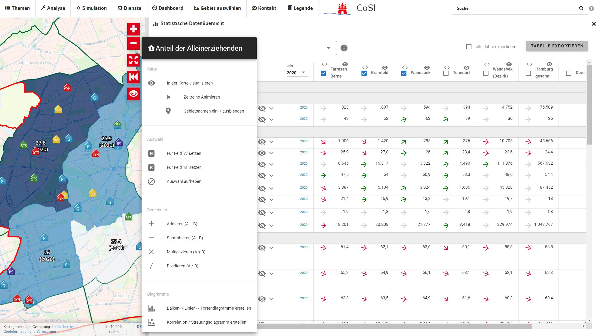

### Statistische Datenübersicht

In der statistischen Datenübersicht können tabellarisch Informationen zu den statistischen Daten der ausgewählten Gebiete ([Statistische Datenübersicht](#markdown-header-statistische-datenübersicht)) angezeigt, ausgewertet und exportiert werden.

  > Um zur statistischen Datenübersicht zu gelangen, wählen Sie im Dashboard den Punkt "statistische Datenübersicht" aus. 
  

*Abbildung 27: Statistische Datenübersichtm 1*

*Abbildung 29: Statistische Datenübersicht 2*

1. **Gruppen ein-/ausklappen**
   > Thematische Gruppen (vgl. [Regionalstatistische Daten](./kartenvisualisierung.md)) über das **+** ein- und ausklappen.
2. **Aktionen**
   > - s. [Bürger-Menü](#markdown-header-burgermenü)
   > - Visualisierung ein- / ausschalten: Schaltet die Visualisierung des ausgewählten Indikators zum aktuell gewählten Jahr in der Karte ein/aus
   > - Jahre ein- / ausklappen: Klappt die Tabellenzeile auf um alle Jahre der Zeitreihe darzustellen.
3. **Jahr auswählen**
   > Aktuelles Jahr für die Darstellung in Tabelle und Karte auswählen.
4. **Spalte verschieben**
   > Mit den Pfeilen links/rechts die Spalte verschieben. Die Trennstriche grenzen die Verwaltungsebenen voneinander ab
5. **Spalte ein-/ausblenden**
   > Mit dem Auge kann eine Spalte aus- und eingeblendet werden, um die Tabelle übersichtlicher zu gestalten. Ausgeblendete Spalten werden für Exporte und Diagramme nicht berücksichtigt.
6. **Aggregationsspalten**
   > Die letzten zwei Spalten zeigen standardmäßig Durchschnitts- und Gesamtwert für die **ausgewählten Gebiete** (wie in der Karte dargestellt, nur die ausgewählte Verwaltungsebene). Für relative (anteilige) Indikatoren können keine Aggregationen berechnet werden, da der Bezugsrahmen nicht klar ist.
7. **Spalte auswählen**
   > Spalten für Export und Diagramm-Erstellung auswählen. Ist keine Spalte ausgewählt werden alle verwendet.
8. **Zeile auswählen**
   > Zeilen für Export und Diagramm-Erstellung auswählen. Ist keine Spalte ausgewählt werden alle für den Export bzw. nur die aktuelle für die Diagramme verwendet.
9. **Trendpfeil**
   > Der Trendpfeil zeigt das extrapolierte Wachstum für den nächsten Zeitschritt (in % im Tooltip) an. Für die Abschätzung werden die Steigungen der letzten 5 Zeitschritte, gewichtet nach Aktualität, herangezogen. Die Darstellung erhebt **keinen Anspruch** auf Genauigkeit und berücksichtigt keine anderen Werte über die aktuelle Zeitreihe hinaus.
10. **Themenfilter**
      > Über den Filter können beliebige Indikatoren (sortiert nach Gruppen) für die Darstellung und den Export ausgewählt werden. Die Liste kann im Freitext durchsucht werden.
11. **Tabelle exportieren**
      > Die aktuelle Auswahl (Spalten, Zeilen, Jahre) als XLSX für Excel exportieren. Über das Auswahlfeld *alle Jahre exportieren* kann die gesamte Zeitreihe für die ausgewählten Spalten und Zeilen exportiert werden. Ist keine Spalte oder Zeile ausgewählt werden alle verwendet.
12. **Kartenvisualisierung**
      > Die Darstellung in der Karte entspricht der des Kontrollfeldes [Kartenanalyse regionalstatistischer Daten](./kartenvisualisierung.md).

#### Dreipunkt Menü

*Abbildung 28: Statistische Datenübersicht*

1. **Visualisierung ein-/ausschalten**
   > Thematische Gruppen
2. **Zeitreihe in der Karte animieren**
   > *(Funktioniert nur bei aktiver Kartenvisualisierung)*
3. **Gebietsnamen ein-/ausblenden**
   > *(Funktioniert nur bei aktiver Kartenvisualisierung)*
4. **Für Feld A auswählen**
   > Selektiert das Thema als **Feld A** für Berechnungen und Korrelation (siehe 7, 8, 9, 10, 12)
5. **Für Feld B auswählen**
   > Selektiert das Thema als **Feld B** für Berechnungen und Korrelation (siehe 7, 8, 9, 10, 12)
6. **Auswahl aufheben**
   > Setzt die Felder **A** und **B** zurück
7. **Addieren**
   > Addiert die Werte für **A** und **B** für jede Gebietsspalte und fügt das Ergebnis der Tabelle an. Der neue Datensatz kann ebenfalls in der Karte visualisiert und in anderen Werkzeugen verwendet werden.
8. **Subtrahieren**
   > Analog zu **Addieren**, subtrahiert **A** - **B**.
9. **Multiplizieren**
   > Analog zu **Addieren**, multipliziert **A** x **B**.
10. **Dividieren**
      > Analog zu **Addieren**, dividiert **A** / **B**.
11. **Diagramme erzeugen**
      > Erzeugt Diagramme für den ausgewählten Indikator im [Chartgenerator](./chartgenerator.md) (analog zu [Kartenanalyse regionalstatistischer Daten](./kartenvisualisierung.md)). Visualisiert alle ausgewählten Spalten (s. [Statistische Datenübersicht](#markdown-header-statistische-datenübersicht)).
12. **Korrelations- / Streuungsdiagramm**
      > Visualisiert ein Streuungsdiagramm für die Felder **A** (Y-Achse) über **B** (X-Achse) im [Chartgenerator](./chartgenerator.md) und berechnet die Korrelation (Pearson) zwischen den Datensätzen und zeichet eine Regressionsgerade.
